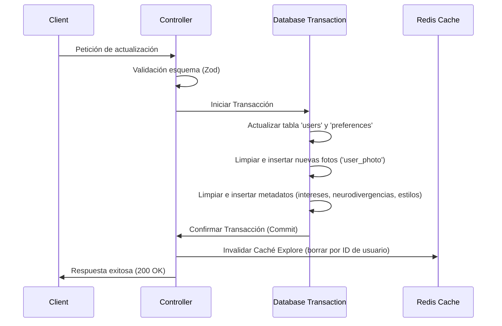

# Gestión de Perfiles (Profile Management)

El sistema de Gestión de Perfiles maneja todo el ciclo de vida de los datos del usuario, incluyendo la obtención, actualizaciones en múltiples tablas de forma transaccional, verificación biométrica y eliminación segura de cuentas.

---

## 1. Obtención de Perfiles

Existen dos formas principales de recuperar datos de perfil dependiendo de quién realice la solicitud:

### `getProfile`
Recupera el perfil completo del usuario autenticado actual, incluyendo campos privados y configuraciones de privacidad.
- **Optimización**: Utiliza subconsultas de agregación JSON para recopilar datos de múltiples tablas asociadas (`users`, `preferences`, `interests`, `neurodivergences` y `communication_styles`) en una sola consulta SQL, reduciendo la latencia de red.

### `getUserProfile` (Acceso Restringido)
Proporciona una vista limitada de otro usuario, protegida por el estado de conexión:
- **Validación de Match**: Comprueba si existe una coincidencia mutua (*match*) activa entre el solicitante y el perfil objetivo.
- **Restricción**: Si no existe una coincidencia, el servidor responde con un error `403 Forbidden`. Los perfiles detallados son privados y solo visibles para usuarios conectados.

---

## 2. Actualización de Perfiles (`updateProfile`)

La función `updateProfile` realiza actualizaciones atómicas y complejas a través de 5 tablas relacionales diferentes en un único flujo de ejecución:

### Lógica de Implementación:
1. **Validación Zod**: El input es validado con `updateProfileSchema`, el cual verifica restricciones de longitud y formatos de foto (Data URI o URL HTTP).
2. **Transacción de Base de Datos**: Todo el proceso ocurre dentro de una transacción de base de datos para asegurar atomicidad. Si alguna inserción falla, se realiza un rollback automático.
3. **Estrategia "Borrar y Reinsertar" para Colecciones**:
   - **Fotos**: Las fotos del usuario en `user_photo` se eliminan por completo y se vuelven a insertar según el nuevo listado.
   - **Intereses, Neurodivergencias y Estilos de Comunicación**: Se limpian las referencias anteriores y se escriben las nuevas selecciones.
4. **Invalidación de Caché**: Una vez completada la transacción, se llama a `invalidateUserExploreCache` para borrar del caché de Redis todas las claves que comiencen con el prefijo ID del usuario. Esto garantiza que aparezca de inmediato con sus datos actualizados en el motor de descubrimiento.

---

## 3. Eliminación de Cuentas (`deleteAccount`)

La eliminación es una operación destructiva de tipo "Hard Delete" que dispara procesos en cascada para proteger la privacidad del usuario:

> [!WARNING]
> Esta operación es irreversible y elimina toda la información relacionada con la cuenta de forma permanente.

### Proceso de Eliminación:
- **Verificación**: Requiere ingresar la contraseña actual del usuario, la cual se valida usando `bcrypt.compare`.
- **Eliminación en Cascada**: Se ejecuta un comando `DELETE FROM users WHERE id_user = $1`. Debido a las políticas `ON DELETE CASCADE` configuradas a nivel de base de datos, esto remueve automáticamente registros en:
  - Fotos de perfil.
  - Intereses y preferencias.
  - Matches establecidos.
  - Mensajes enviados y recibidos.
- **Registro de Auditoría (Audit Log)**: Se registra el evento de forma anónima en `account_deletion_log` con fines regulatorios y de métricas de retención de la plataforma.
- **Cola de Correos**: Envía un email de confirmación y encola tareas pendientes mediante la cola de envío de correos del sistema.

---

## 4. Estado de Verificación y Privacidad

### Verificación de Rostro (Face Verification)
El endpoint `markFaceVerification` actúa como un interruptor (*toggle*) tras pasar con éxito una prueba biométrica de verificación de rostro, cambiando el booleano `is_face_verified` a `true` en la tabla de usuarios.

### Integración en Tiempo Real (Sockets)
Cuando un usuario modifica su visibilidad (por ejemplo, cambia a modo invisible / `is_visible: false`):
- El controlador invoca la función `handleUserVisibilityChange`.
- Esta función notifica de inmediato al servicio de **Socket.io** para actualizar el mapa de usuarios invisibles (`invisibleUsers`) y notificar en tiempo real a los demás peers conectados.

---

## 5. Automigración de Base de Datos (Schema Self-Management)

Para facilitar el desarrollo y evitar la dependencia estricta de scripts manuales de migración en fases iniciales, el controlador incluye funciones de "aseguramiento" que validan la estructura de la base de datos en tiempo de ejecución:

- **`ensureMatchTable`**: Comprueba la existencia de la tabla de coincidencias y la crea en caso de no existir.
- **`ensurePrivacyColumns`**: Asegura que columnas de privacidad recientes (como `show_online_status`) existan en la tabla `users`, aplicando comandos `ALTER TABLE` dinámicos si hacen falta.
- **`ensureAtmosphereColumn`**: Verifica y añade la columna `atmosphere` a las preferencias del usuario dinámicamente si falta.
