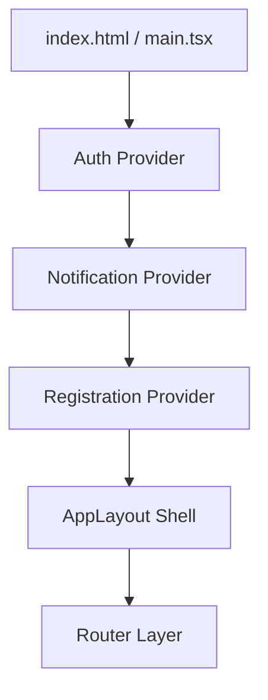

# Arquitectura y Diseño del Frontend

El frontend de Bluvi (`bluvi-frontend`) está desarrollado como una SPA (Single Page Application) utilizando **React 19, TypeScript y Vite**, y se despliega de manera eficiente en **Cloudflare Pages**. 

Esta aplicación destaca por su enfoque prioritario en la accesibilidad cognitiva y la neurodivergencia.

---

## 1. Filosofía de Diseño: Neurodiversidad y Accesibilidad (a11y)

Para reducir la sobrecarga cognitiva y la ansiedad sensorial, el frontend sigue directrices estrictas de diseño:

- **Interfaces de Calma**: Utiliza paletas de colores suaves y no saturadas junto con tipografías de alta legibilidad para evitar la fatiga visual.
- **Previsibilidad y Control**: Los flujos complejos informan al usuario en todo momento sobre su progreso actual mediante indicadores dinámicos de pasos, minimizando la incertidumbre.
- **Control Sensorial**: Permite al usuario configurar globalmente la reducción de movimiento (desactivando transiciones y animaciones complejas) y la opacidad de los fondos (evitando transparencias que dificulten la lectura).

---

## 2. Arquitectura de la Aplicación

El proyecto sigue una arquitectura modular en capas basada en **Proveedores de Contexto (Context Providers)** que envuelven el sistema de enrutamiento principal.

### Estructura de Capas
- **Capa de Autenticación**: Maneja el estado de la sesión, la obtención del perfil propio y la renovación automática de tokens JWT.
- **Capa de Registro (Wizard)**: Administra el estado intermedio de un registro guiado de 14 pasos a través de un contexto de persistencia temporal.
- **Capa de Layout (AppLayout)**: Sirve como el contenedor primario para todas las rutas autenticadas, gestionando márgenes de pantalla e integrando preferencias de accesibilidad.

---

## 3. Lógica de Maquetación (Layouts)

El enrutador conmuta dinámicamente entre tres esquemas de diseño base (*Layouts*):

- **WelcomeLayout**: Usado en pantallas públicas (Login, Bienvenida, páginas legales).
- **RegisterLayout**: Contenedor especializado para el flujo de onboarding.
- **AppLayout**: El marco del panel interno autenticado. Gestiona la separación del header de navegación superior (mediante la metadata `topOffset`) y restringe las transiciones animadas si se ha habilitado la opción de reducción de movimiento.

---

## 4. Subsistemas Clave del Cliente

### Asistente de Registro (Registration Wizard)
Un flujo asistido de 14 pasos que recopila información clave del usuario (intereses, neurodivergencias, estilos de comunicación y fotos). Este proceso divide la carga de entrada de datos en pequeñas pantallas individuales muy predecibles.

### Sistema de Descubrimiento (Discovery)
Interfaz optimizada para la visualización y navegación de perfiles recomendados según algoritmos de matching. Permite interactuar directamente mediante solicitudes de conexión.

### Mensajería en Tiempo Real
Un cliente WebSocket implementado sobre **Socket.io-client** e integrado con el store global de Zustand para reaccionar inmediatamente ante:
- Entrada y salida de mensajes.
- Confirmaciones de lectura (Read receipts).
- Indicador de estado "en línea" y "escribiendo".
- Envío y reproducción de contenido de audio y fotos.

---

## 5. Comunicación de API y Servicios

Toda la comunicación de red está centralizada en una capa de servicios (`src/services/`):
- **Cliente HTTP**: Basado en Axios/Fetch, configura interceptores de cabeceras para inyectar y refrescar automáticamente el token de acceso, redirigiendo de forma segura al Login en caso de tokens expirados o inválidos.
- **Cliente WebSocket**: Mantiene una conexión Socket persistente y segura, mapeando eventos del servidor a mutaciones de estado en local.
