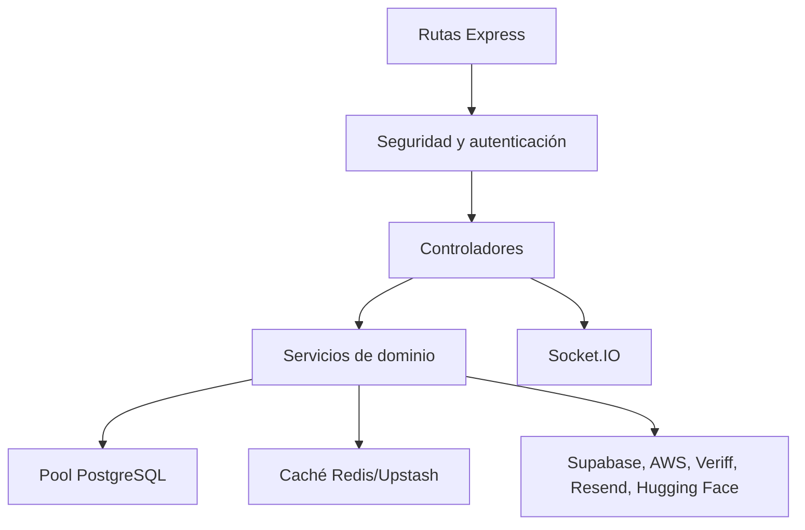

# Arquitectura y tecnologías

## Componentes

| Componente | Tecnología principal | Responsabilidad |
| --- | --- | --- |
| Frontend web | React 19, TypeScript, Vite, React Router 7 | SPA pública, privada y administrativa |
| Backend | Node.js, Express 5, TypeScript | API REST, autenticación y reglas de negocio |
| Mobile | Expo 56, React Native 0.85, Expo Router 56 | Cliente Android/iOS con capacidades nativas |
| Persistencia | PostgreSQL mediante `pg` y Supabase | Usuarios, perfiles, matches, chats y catálogos |
| Caché | Redis/Upstash | Discovery, metadatos, rate limiting y datos temporales |
| Multimedia | Supabase Storage y servicios compatibles S3/R2 | Fotos, audio y archivos de chat |
| Tiempo real | Socket.IO 4 | Mensajes, presencia, typing y estados de entrega |
| Hosting | Cloudflare Workers, Railway, EAS | Web, API y distribución móvil |

## Flujo de una petición

1. El cliente obtiene la URL del backend desde configuración de entorno.
2. Axios añade el access token cuando la operación requiere autenticación.
3. Express aplica `helmet`, CORS, parsing, cookies, proxy trust y rate limits.
4. La ruta valida autenticación, permisos y payload con middleware/controlador.
5. El controlador consulta PostgreSQL y usa caché o almacenamiento cuando aplica.
6. La respuesta JSON vuelve al cliente; Socket.IO se utiliza para actualizaciones
   que no deben esperar a un nuevo polling.

## Límites entre repositorios

- `bluvi-frontend` no debe editarse desde el proyecto móvil; cada cliente tiene
  su propio ciclo de build y despliegue.
- `bluvi-backend` es la autoridad para datos, autenticación, autorización,
  verificación, moderación y resultados de operaciones sensibles.
- `bluvi-mobile` añade permisos de cámara, micrófono, galería, notificaciones,
  almacenamiento seguro y módulos nativos que no existen en la web.

## Capas del backend

Las rutas viven en `src/routes`, la lógica HTTP en `src/controllers`, la lógica
reutilizable en `src/services` y la configuración de runtime en `src/config`.

## Versiones relevantes

Las versiones exactas se mantienen en cada `package.json` y lockfile. En la
revisión actual destacan Node 22 en CI del backend, TypeScript 5.9/6.0,
React 19, Express 5, Expo SDK 56 y React Native 0.85.
