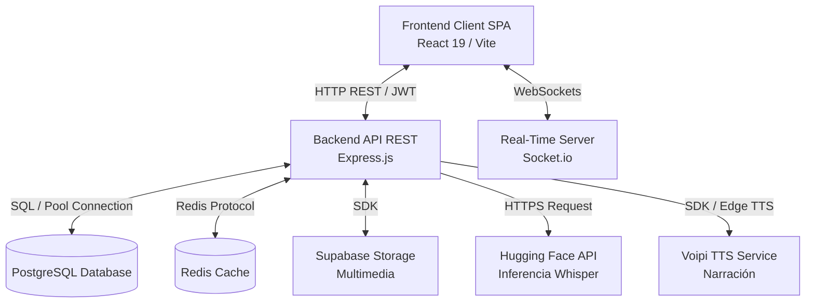

# Arquitectura, Lenguajes y Requisitos de Versión

Este documento detalla la estructura lógica del sistema **Bluvi**, los lenguajes de programación empleados en su desarrollo y las dependencias de versiones necesarias para ejecutar e integrar el proyecto.

---

## 1. Arquitectura de la Aplicación

Bluvi se sustenta en una **arquitectura cliente/servidor desacoplada** y distribuida en capas especializadas. Esto garantiza la separación de responsabilidades y la modularidad del código:

### Componentes de la Arquitectura
- **Capa Cliente (Frontend SPA)**: Una interfaz moderna diseñada para consumir servicios de forma asíncrona mediante peticiones HTTP estructuradas y flujos de eventos WebSocket en tiempo real.
- **Capa de Servidor (Backend API)**: Un servidor Express que gestiona el enrutamiento HTTP, la seguridad mediante middlewares (rate limiting, validación Zod, cabeceras Helmet) y la lógica transaccional con la base de datos PostgreSQL.
- **Capa en Tiempo Real (Real-time Layer)**: Un servidor de websockets montado sobre Socket.io que mantiene conexiones bidireccionales activas para mensajería instantánea y presencia en línea.
- **Capa de Almacenamiento e Inferencia**: PostgreSQL guarda la persistencia relacional, Redis maneja el cacheo e invalidación rápida de búsquedas, Supabase almacena notas de voz y fotos, y Hugging Face realiza tareas de inteligencia artificial para traducción ASR (Whisper).

---

## 2. Lenguajes de Programación Utilizados

El desarrollo de la plataforma se unifica bajo el ecosistema de JavaScript moderno:

- **TypeScript**: Se emplea de forma nativa en todo el backend y frontend para proporcionar tipado estático, autocompletado y detección de errores en fase de compilación.
- **JavaScript (ES Modules)**: Entorno estándar de empaquetado y ejecución.
- **SQL (PostgreSQL dialect)**: Para modelar relaciones complejas de datos, restricciones de integridad relacional (`ON DELETE CASCADE`) y subconsultas de agregación JSON.
- **HTML5 & CSS3**: Para la estructura de la aplicación y la maquetación accesible (diseñada con TailwindCSS v4 y variables nativas CSS).

---

## 3. Requisitos de Versión

Para garantizar el correcto funcionamiento y despliegue del proyecto, se deben cumplir los siguientes requisitos mínimos de software:

### Entorno de Ejecución (Node.js)
- **Frontend**: Requiere **Node.js v18.0.0** o superior.
- **Backend**: Requiere **Node.js v22.0.0** o superior (debido al uso del importador nativo de módulos de TypeScript `tsx` y la suite de pruebas nativa `node --test`).

### Frameworks y Librerías Principales
| Componente | Tecnología | Versión Mínima / Recomendada | Notas |
| :--- | :--- | :--- | :--- |
| **Frontend** | React | `^19.2.0` | React 19 (última versión estable) |
| **Frontend** | React Router DOM | `^7.13.0` | Gestión de rutas dinámicas |
| **Frontend** | Vite | `^7.2.4` | Herramienta de compilación rápida |
| **Backend** | Express | `^5.2.1` | Manejo de peticiones HTTP |
| **Backend** | TypeScript | `~5.9.3` | Compilador y tipado estático |
| **Tiempo Real** | Socket.io / Socket.io-client | `^4.8.3` | Comunicación WebSockets duplex |

### Motores de Base de Datos y Caché
- **PostgreSQL**: Versión **15.0** o superior (necesaria para soporte nativo de JSONB y funciones avanzadas de agregación).
- **Redis**: Versión **6.2** o superior (para soporte de TTL por clave y clientes distribuidos en la nube).
