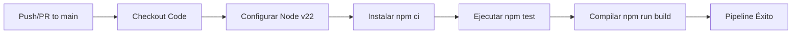

# Despliegue en la Nube y CI/CD

Este documento describe el flujo y las herramientas necesarias para poner en producción las aplicaciones frontend y backend de **Bluvi**, así como el funcionamiento de la integración continua (CI/CD).

---

## 1. Despliegue del Backend

El backend de Bluvi es una API REST con persistencia en PostgreSQL y caché en Redis. Está preparado para desplegarse en plataformas PaaS como **Railway** o **Render**:

### Proceso de Despliegue manual / guiado:
1. Crea una base de datos PostgreSQL gestionada en la nube (por ejemplo en Supabase o en la propia base de datos Postgres de Railway).
2. Crea una instancia de Redis gestionada (por ejemplo en Upstash o en Railway).
3. Conecta el repositorio de GitHub de `bluvi-backend` a tu servicio PaaS.
4. Configura las variables de entorno de producción en la plataforma (ver variables críticas abajo).
5. Especifica el comando de inicio en la plataforma:
   - Build command: `npm run build`
   - Start command: `npm start`

### Variables de Entorno en Producción:
En el panel del servidor en la nube, asegúrate de definir:
- `NODE_ENV=production`
- `DATABASE_URL`: Cadena de conexión directa con SSL de tu PostgreSQL en producción.
- `DATABASE_SSL=true` (activa la conexión encriptada para bases de datos como Supabase).
- `REDIS_URL`: Endpoint de Redis seguro.
- `JWT_ACCESS_SECRET` y `JWT_REFRESH_SECRET`: Claves criptográficas fuertes.
- `ALLOWED_ORIGINS`: URL del frontend de producción (ejemplo: `https://bluvi.pages.dev`).
- `TRUST_PROXY=true`: Requerido para capturar la IP real del cliente detrás de balanceadores de carga para que el rate limit actúe eficazmente contra ataques de fuerza bruta.

---

## 2. Despliegue del Frontend

El frontend de Bluvi se compila a archivos estáticos (SPA) y está optimizado para desplegarse en **Cloudflare Pages** o **Vercel**:

### Despliegue con Cloudflare Pages (Recomendado):
El frontend incluye un archivo de configuración `wrangler.jsonc` y un script `deploy` para usar Cloudflare Wrangler de forma directa.

#### Opción A: Despliegue automático (Git Integration)
1. Ve al panel de Cloudflare Pages y crea un nuevo proyecto conectado a tu repositorio `bluvi-frontend`.
2. Selecciona la configuración de compilación para **Vite**:
   - Framework preset: `Vite`
   - Build command: `npm run build`
   - Build output directory: `dist`
3. En la pestaña de configuración del proyecto, agrega las variables de entorno:
   - `VITE_BACKEND_URL`: URL del backend publicado en producción (ej. `https://bluvi-backend.railway.app`).
   - `VITE_SUPABASE_URL` y `VITE_SUPABASE_ANON_KEY`.
4. Guarda y haz un despliegue inicial.

#### Opción B: Despliegue por línea de comandos (Wrangler CLI)
Para desplegar manualmente desde tu consola local:
```bash
npm run deploy
```
*Este comando compilará el proyecto y subirá los estáticos a Cloudflare usando la cuenta autenticada.*

---

## 3. Integración y Despliegue Continuo (CI/CD)

Para mantener la calidad del software y automatizar la entrega, el proyecto integra pipelines de desarrollo continuo:

### Backend CI (GitHub Actions)
Cada vez que se sube código o se crea un Pull Request hacia la rama `main` en el repositorio del backend, se dispara el flujo automatizado definido en `.github/workflows/ci-backend.yml`:



El pipeline realiza los siguientes pasos automatizados en la nube de GitHub:
1. **Checkout**: Descarga el código fuente del commit.
2. **Setup Node**: Levanta un entorno Ubuntu limpio con Node.js v22.
3. **Instalación limpia (`npm ci`)**: Instala las dependencias respetando estrictamente el archivo `package-lock.json`.
4. **Pruebas (`npm test`)**: Ejecuta la suite de pruebas unitarias internas.
5. **Compilación (`npm run build`)**: Compila TypeScript a JavaScript nativo para verificar que no existan errores de tipos.

### CD (Despliegue Continuo)
- **Frontend**: Cloudflare Pages detecta de forma automática los nuevos commits en la rama `main`, compila la aplicación usando las variables configuradas en su panel y actualiza el sitio de producción en segundos sin caída del servicio.
- **Backend**: Plataformas como Railway o Render realizan el redeploy automático tras el éxito del pipeline de GitHub, clonando la última versión del commit de `main`, construyendo el contenedor y conmutando el tráfico HTTP hacia la nueva instancia.
