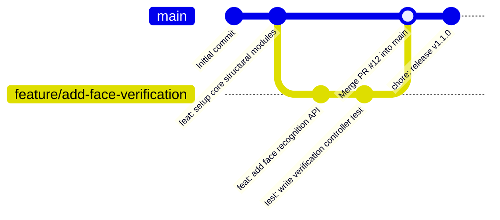

# Estrategia de Git y GitHub

Este documento describe la estructura de control de versiones, el flujo de trabajo con ramas y la nomenclatura de commits utilizada en el desarrollo de **Bluvi**.

---

## 1. Estructura de Repositorios: Multirrepo

En lugar de utilizar un monorrepo, Bluvi ha sido diseñado bajo una estructura **multirrepo**, manteniendo el código cliente y servidor en repositorios de GitHub independientes y aislados:

- **Estructura decoupled**: Evita que los cambios del frontend interfieran con el backend en el historial de Git, permitiendo despliegues ágiles e independientes en nubes separadas (Railway y Cloudflare).
- **Control de accesos y dependencias**: Cada repositorio posee sus propios linters, archivos de configuración de TypeScript y pipelines de integración continua.

Los repositorios principales de la plataforma son:
- **Backend API**: `https://github.com/Juls010/bluvi-backend`
- **Frontend SPA**: `https://github.com/Juls010/bluvi-frontend`
- **Documentación**: `https://github.com/Juls010/bluvi_documentation` (Este repositorio)

---

## 2. Estrategia de Ramas y Fusión (Workflow)

El flujo de desarrollo se basa en una versión simplificada de *Git Flow*, estructurado en una rama principal estable y ramas efímeras de trabajo:



### Definición de Ramas
- **`main`**: Es la rama principal. Siempre contiene código estable, testeado y listo para producción. Está protegida contra envíos de código directos (`push`); toda adición debe pasar por un Pull Request (PR).
- **Ramas de Características (`feature/nombre-de-tarea`)**: Ramas temporales creadas para añadir funcionalidades (ej. `feature/onboarding-wizard`). Se abren a partir de `main` y se eliminan una vez integradas.
- **Ramas de Corrección (`fix/nombre-de-error`)**: Ramas destinadas a corregir fallos detectados en producción (ej. `fix/jwt-expiration-check`).

---

## 3. Integración en `main` y Aprobación de Cambios

Para integrar cambios en la rama principal, se debe seguir el siguiente flujo de calidad:

1. **Pruebas Locales**: El desarrollador debe ejecutar y pasar la suite de pruebas unitarias (`npm test`) y verificar el tipado estático (`npm run build`) de forma local antes de subir la rama a GitHub.
2. **Creación de Pull Request (PR)**: Se abre un PR detallando la característica añadida o el error solucionado.
3. **Resolución de Conflictos**: Si existen conflictos con `main`, el desarrollador es responsable de rebasar (`git rebase main`) o fusionar `main` localmente en su rama de trabajo para resolver las colisiones de código antes de la fusión final.
4. **Validación de CI**: La pipeline de GitHub Actions (`ci-backend.yml`) debe compilar correctamente y pasar todas las pruebas de integración en la nube. **Si el pipeline falla, el botón de merge se bloquea automáticamente.**

---

## 4. Estructura de Commits (Conventional Commits)

Los commits del proyecto deben seguir la convención internacional de **Conventional Commits**. Esto ayuda a generar historiales de cambios autodescriptivos y facilita la generación de changelogs.

El formato estándar del mensaje de commit es:
```
<tipo>(<ámbito opcional>): <descripción corta en minúsculas>
```

### Tipos de Commits permitidos:
- **`feat`**: Una nueva funcionalidad para el usuario final (ej. `feat(auth): implement 14-step onboarding wizard`).
- **`fix`**: Solución de un bug o error en el sistema (ej. `fix(db): cascade delete unverified users`).
- **`docs`**: Cambios únicamente en archivos de documentación (ej. `docs: add local setup guide`).
- **`style`**: Cambios estéticos o de formato que no afectan el comportamiento del código (ej. `style: format imports using prettier`).
- **`refactor`**: Reestructuración de código que no añade características ni corrige bugs (ej. `refactor: extract socket initialization hook`).
- **`test`**: Añadir o modificar casos de prueba unitarios o de integración (ej. `test: add unit test for profile deletion`).
- **`chore`**: Tareas administrativas, dependencias o configuración del build (ej. `chore: upgrade express dependency to v5.2.1`).
