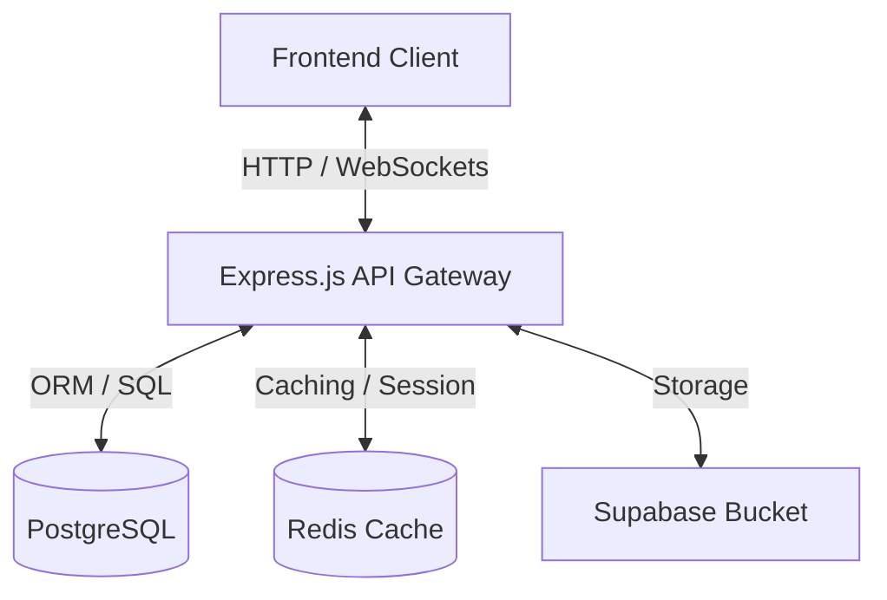

# Introducción a Bluvi

¡Bienvenido a la documentación oficial de **Bluvi**! 

Este espacio centraliza toda la documentación técnica, arquitectónica y operativa tanto del **Frontend** como del **Backend** de la plataforma.

---

## ¿Qué es Bluvi?

Bluvi es una plataforma moderna diseñada para conectar personas. Cuenta con una arquitectura robusta que combina un backend en tiempo real, un motor de búsqueda/descubrimiento rápido y servicios avanzados de accesibilidad.

---

## Arquitectura del Proyecto

El sistema está dividido en tres componentes principales:

### 1. Documentación General
Contiene guías de arquitectura general del sistema, flujos de negocio globales y el glosario de términos comunes.

### 2. Backend (bluvi-backend)
Construido con:
- **Node.js & Express**: API RESTful y pipeline de Middlewares.
- **TypeScript**: Tipado seguro.
- **PostgreSQL**: Base de datos relacional transaccional.
- **Redis**: Sistema de caché para optimización del motor de descubrimiento (Explore).
- **Socket.io**: Capa interactiva en tiempo real (mensajería, estados).
- **Supabase**: Almacenamiento multimedia.

### 3. Frontend (bluvi-frontend)
Documentación sobre la interfaz de usuario, diseño de componentes, flujo de estado y consumo de APIs de la plataforma.

---

## Cómo empezar

Selecciona una sección en la barra superior para explorar la documentación detallada:
- Ir a [Documentación del Backend](/back/intro)
- Ir a [Documentación del Frontend](/front/intro)
