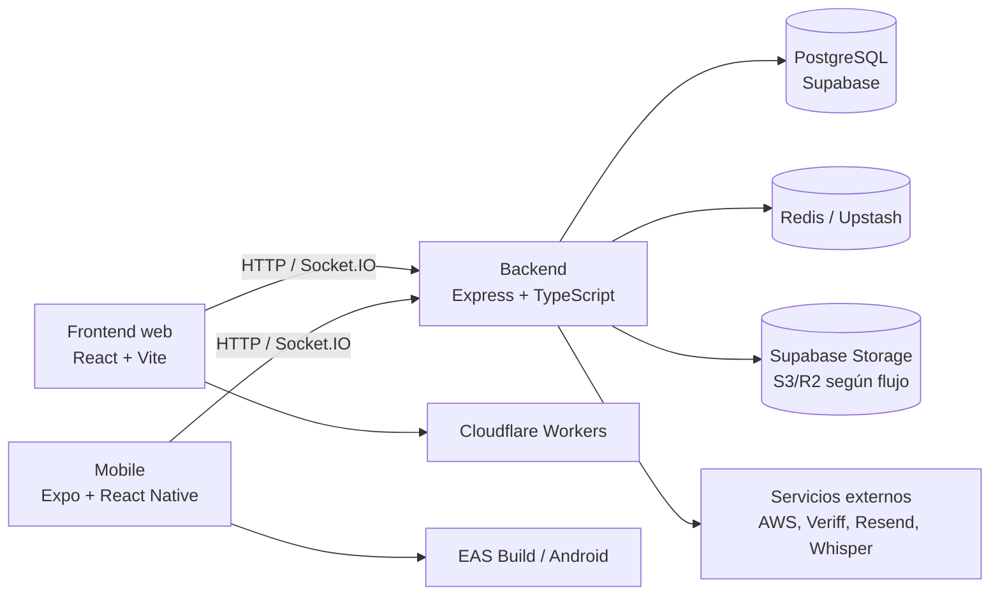

# Introducción a Bluvi

Bluvi es una plataforma social inclusiva para crear conexiones seguras,
auténticas y accesibles. La documentación reúne el estado técnico de sus tres
aplicaciones y de los servicios que las conectan.

## Arquitectura general

El sistema es un **multirepo**. El frontend web y la app móvil comparten el
backend, pero tienen clientes HTTP, almacenamiento de credenciales, navegación
y capacidades nativas diferentes.

## Recorrido de la documentación

- [Guías generales](/general/architecture): arquitectura, colaboración y despliegue.
- [Backend](/back/intro): API REST, persistencia, seguridad, tiempo real y operación.
- [Frontend web](/front/intro): rutas, componentes, estado, accesibilidad y Cloudflare.
- [Mobile](/mobile/intro): Expo Router, capacidades nativas, EAS, i18n y E2E.

## Principios compartidos

- La autenticación se basa en tokens de acceso y renovación; el almacenamiento
  cambia según la plataforma: cookies seguras en web y `SecureStore` en móvil.
- La privacidad, la moderación, la accesibilidad cognitiva y el control del
  usuario son requisitos funcionales, no solo decisiones visuales.
- El cliente nunca es autoridad para resultados sensibles de verificación,
  permisos de multimedia o moderación; esas decisiones se validan en backend.
